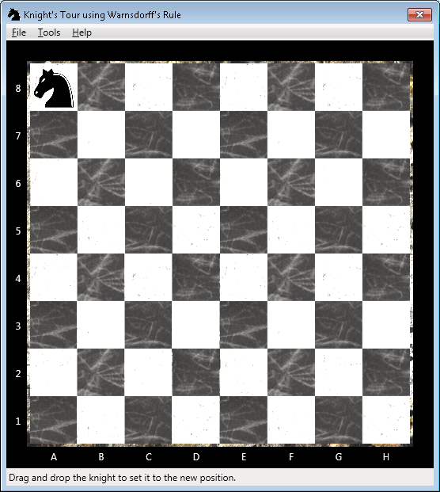
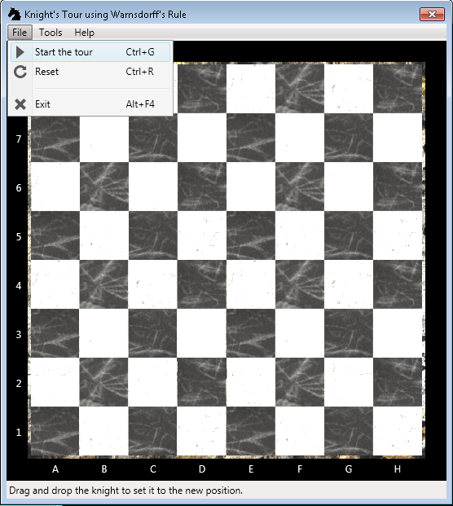
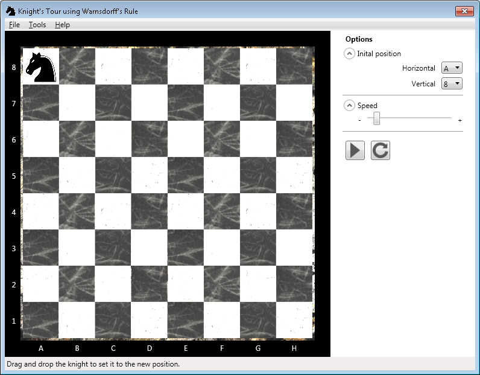
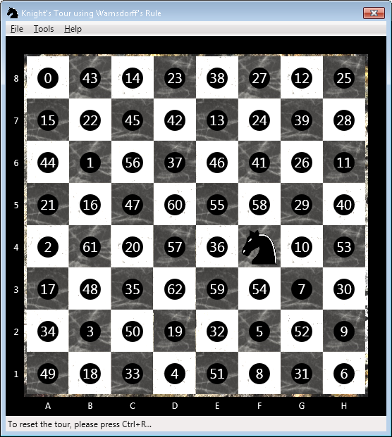

# Knight Tour #

A knight's tour is a sequence of moves of a knight on a chessboard.

### Details ###

A knight's tour is a sequence of moves of a knight on a chessboard such that the knight visits 
every square only once. 

If the knight ends on a square that is one knight's move from the beginning square (so that it 
could tour the board again immediately, following the same path), the tour is closed, 
otherwise it is open. 

The knight's tour problem is the mathematical problem of finding a knight's tour. Creating a 
program to find a knight's tour is a common problem given to computer science students. 
Variations of the knight's tour problem involve chessboards of different sizes than the 
usual 8 × 8, as well as irregular (non-rectangular) boards.

### Why I wrote this app? ###

I have been "away" from programming for a while, due to several factors and reasons, such 
as (1) birth of my son (who is almost 5 years old now), (2) moving to a new country, 
(3) learning a new (Dutch) language and studying for obligatory integration exams. 

At the moment I'm "refreshing" my knowledge and skills. Writing apps like this seems 
the best way to do so.

I have a bachelor degree in Software Engineering, Master's degree in Information 
Technologies and work experience using C#/.NET, Adobe LifeCycle and JavaScript. 
See my CV for a full list of my knowledge set and skills.

If you are a company looking for (female) developers in Groningen area (the Netherlands), 
do not hesitate to [contact me](mailto:anahit.gardishyan@gmail.com).

### How to run? ###

See the Release directory for the release version.

### Screen shots ###

**Main application screen**

**File menu**

**Options**

**Final result**

### License ###

[MIT License](LICENSE.txt)

### Author ###

Anahit Gardishyan [anahit.gardishyan@gmail.com](mailto:anahit.gardishyan@gmail.com)
